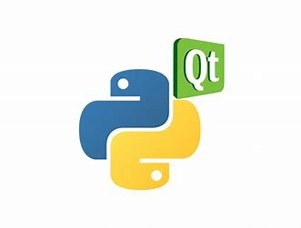

# Hello there!

## This my user interface practice using pyqt5

## A brief about pyqt5

    1. This is all in python language 

    2. classes and objects are used
    
    3. Easy to understand
  
## Basic things to install before

Enter this commands in terminal

First Install QT

    pip install pyqt5

Then install it's designer

    pip install designer
  
## QT python docs

https://doc.qt.io/qtforpython-5/

## Youtube reference videos

https://youtube.com/playlist?list=PLCC34OHNcOtpmCA8s_dpPMvQLyHbvxocY
